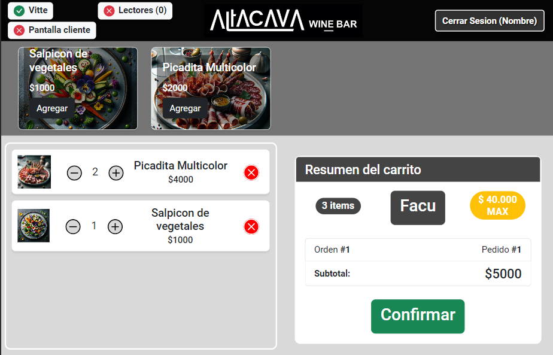
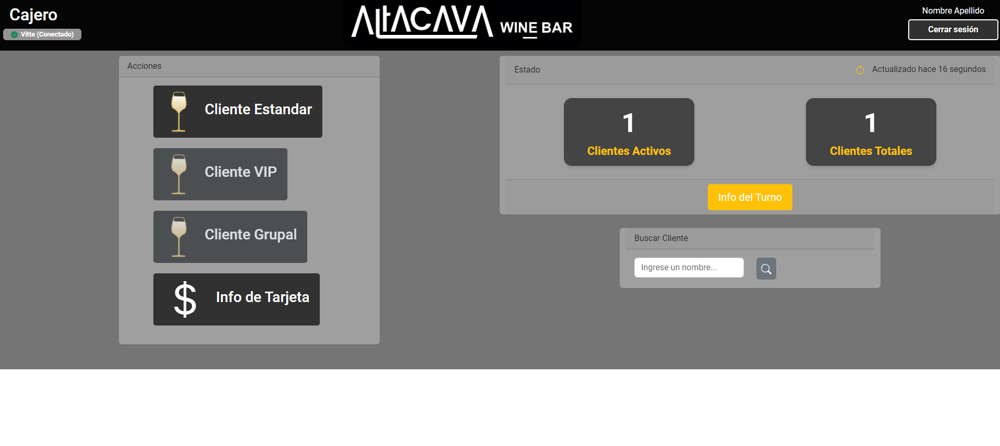
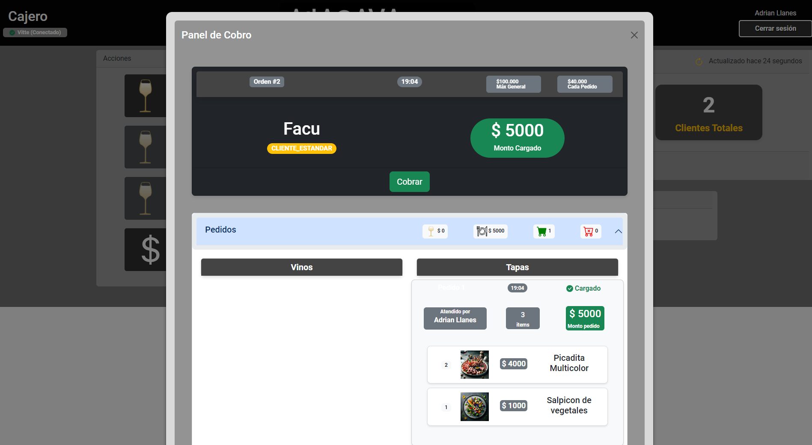
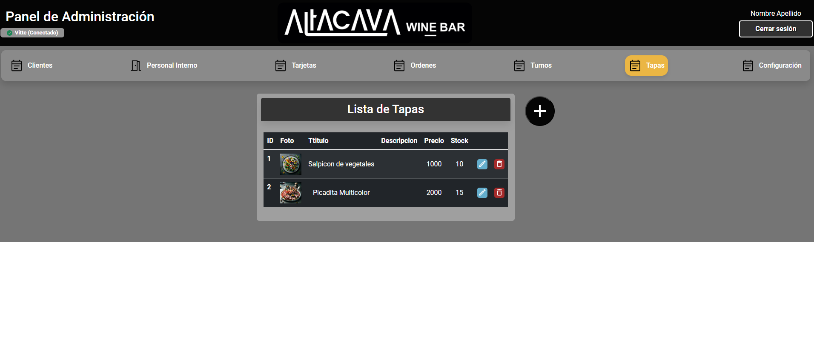

# FastBar: Sales Management System for fast-food bars

FastBar is a system designed for fast-service bars. It tracks and process consumptions and, optionally, integrates with RFID-based Wine dispensers (like Vitte). This provides a a solution for auto-bar sales management through a unique card given to each client.

## Screenshots

- **Dispatcher view** for taking orders.

  

- **Cashier view** for processing orders.

  
  

- **Admin view** for overall management.

  

## Project Structure

This repository contains the backend code and serves as the main entry point for the project. The application consists of three main components:

1. Backend (this repository) - Provides the API and database functionality
2. [Frontend](https://github.com/allanes/winebar-4-frontend) - React UI
3. [Key/LCD Server](https://github.com/allanes/winebar-servidor-claves) - Lightweight local key provider and LCD 4x20 display handler.

## Technology Stack

- Backend: FastAPI + PostgreSQL
- Frontend: React + Typescript
- Key/LCD Server: FastAPI and LCD connected to a RaspberryPi
- Deployment: docker-compose. 


## Prerequisites

Before running the application, make sure you have the following installed:

- Git
- Docker Compose

## Getting Started

1. Clone the repositories:

    ```
    git clone https://github.com/allanes/winebar-4.git
    cd winebar-4
    git submodule init
    git submodule update
    ```

2. Create a copy of the `.env.example` file and rename it to `.env`:

    ```
    copy .env.example .env
    ```

3. Update the `.env` file with your specific configuration values, such as database credentials and API keys.

    NOTE: use `openssl rand -hex 32` for generating new keys.

4. Build and run the Docker containers:

    ```
    docker-compose up --build -d
    ```


## Using the app

- Navigate to http://localhost and login using '1234' as default user. That will open the admin view.
- Navigate to http://localhost/cajerosView to open the cashier panel.
- Navigate to http://localhost/taperosView to open the tapero panel.
- The backend interactive documentation will be at http://localhost/backend/docs.

## Documentation

- Backend API docs: http://localhost/backend/docs

