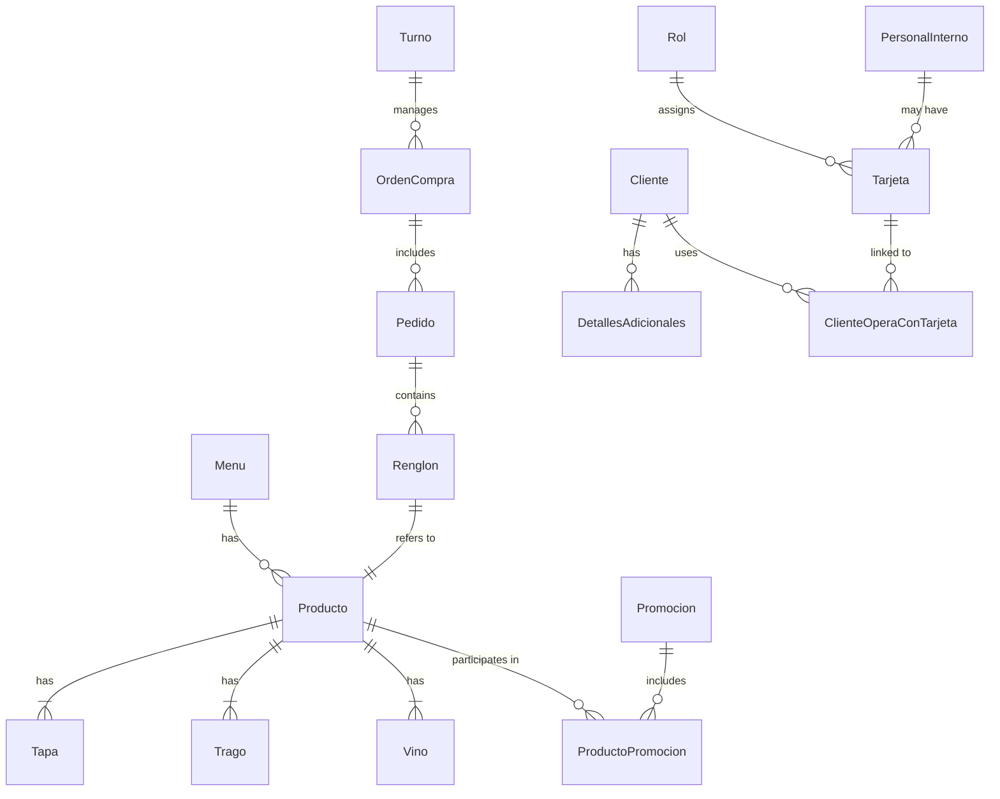

```mermaid
erDiagram
    Menu ||--o{ Producto : has
    Producto ||--|{ Tapa : has
    Producto ||--|{ Trago : has
    Producto ||--|{ Vino : has
    Producto ||--o{ ProductoPromocion : "participates in"
    Promocion ||--o{ ProductoPromocion : includes
    Turno ||--o{ OrdenCompra : manages
    OrdenCompra ||--o{ Pedido : includes
    Pedido ||--o{ Renglon : contains
    Renglon ||--|| Producto : "refers to"
    Rol ||--o{ Tarjeta : assigns
    Cliente ||--o{ DetallesAdicionales : "has"
    Cliente ||--o{ ClienteOperaConTarjeta : uses
    Tarjeta ||--o{ ClienteOperaConTarjeta : "linked to"
    PersonalInterno ||--o{ Tarjeta : "may have"
```
