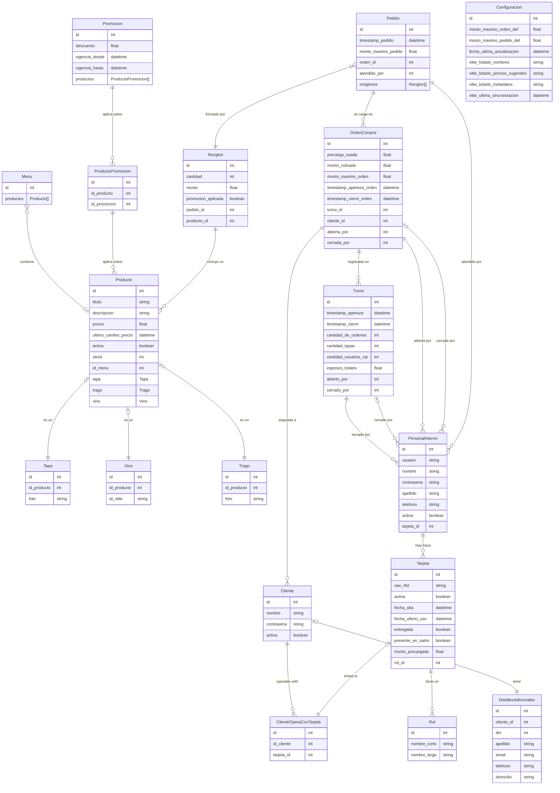

```mermaid
erDiagram
    Menu }o--o| Producto : "contiene"
    Producto |o--|| Tapa : "es un"
    Producto |o--|| Vino : "es un"
    Producto |o--|| Trago : "es un"
    ProductoPromocion ||--o{ Producto : "aplica sobre"
    Promocion ||--o{ ProductoPromocion : "aplica sobre"
    Turno ||--o{ PersonalInterno : "iniciado por"
    Turno |o--o{ PersonalInterno : "cerrado por"
    OrdenCompra ||--o{ Turno : "registrada en"
    OrdenCompra ||--o{ Cliente : "asignada a"
    Pedido ||--o{ OrdenCompra : "se carga en"
    OrdenCompra ||--o{ PersonalInterno : "abierta por"
    OrdenCompra |o--o{ PersonalInterno : "cerrada por"
    Cliente ||--o{ ClienteOperaConTarjeta : "operates with"
    Cliente |o--|| DetallesAdicionales : "tiene"
    
    Tarjeta |o--|| ClienteOperaConTarjeta : "linked to"
    Renglon ||--o{ Producto : "incluye un"
    Pedido }|--|| Renglon : "formado por"
    Pedido ||--o{ PersonalInterno : "atendido por"
    Tarjeta ||--o{ Rol : "tiene un"
    PersonalInterno ||--o{ Tarjeta : "may have"
    Rol {
        id int
        nombre_corto string
        nombre_largo string
    }
    Tarjeta {
        id int
        raw_rfid string
        activa boolean
        fecha_alta datetime
        fecha_ultimo_uso datetime
        entregada boolean
        presente_en_salon boolean
        monto_precargado float
        rol_id int
    }
    Cliente {
        id int
        nombre string
        contrasena string
        activa boolean
    }
    PersonalInterno {
        id int
        usuario string
        nombre string
        contrasena string
        apellido string
        telefono string
        activa boolean
        tarjeta_id int
    }
    DetallesAdicionales {
        id int
        cliente_id int
        dni int
        apellido string
        email string
        telefono string
        domicilio string
    }
    ClienteOperaConTarjeta {
        id int
        id_cliente int
        tarjeta_id int
    }
    Menu {
        id int
        productos Producto[]
    }
    Producto {
        id int
        titulo string
        descripcion string
        precio float
        ultimo_cambio_precio datetime
        activa boolean
        stock int
        id_menu int
        tapa Tapa
        trago Trago
        vino Vino
    }
    Tapa {
        id int
        id_producto int
        foto string
    }
    Trago {
        id int
        id_producto int
        foto string
    }
    Vino {
        id int
        id_producto int
        id_vitte string
    }
    Promocion {
        id int
        descuento float
        vigencia_desde datetime
        vigencia_hasta datetime
        productos ProductoPromocion[]
    }
    ProductoPromocion {
        id int
        id_producto int
        id_promocion int
    }
    Turno {
        id int
        timestamp_apertura datetime
        timestamp_cierre datetime
        cantidad_de_ordenes int
        cantidad_tapas int
        cantidad_usuarios_vip int
        ingresos_totales float
        abierto_por int
        cerrado_por int
    }
    OrdenCompra {
        id int
        precarga_usada float
        monto_cobrado float
        monto_maximo_orden float
        timestamp_apertura_orden datetime
        timestamp_cierre_orden datetime
        turno_id int
        cliente_id int
        abierta_por int
        cerrada_por int
    }
    Pedido {
        id int
        timestamp_pedido datetime
        monto_maximo_pedido float
        orden_id int
        atendido_por int
        renglones Renglon[]
    }
    Renglon {
        id int
        cantidad int
        monto float
        promocion_aplicada boolean
        pedido_id int
        producto_id int
    }    
    Configuracion {
        id int
        monto_maximo_orden_def float
        monto_maximo_pedido_def float
        fecha_ultima_actualizacion datetime
        vitte_listado_nombres string
        vitte_listado_precios_sugeridos string
        vitte_listado_metadatos string
        vitte_ultima_sincronizacion datetime
    }
```
