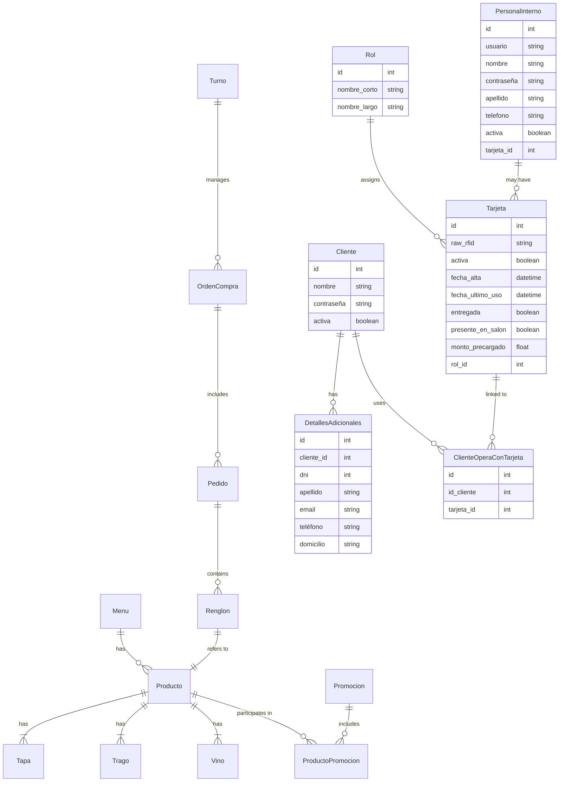

```mermaid
erDiagram
    Menu ||--o{ Producto : has
    Producto ||--|{ Tapa : has
    Producto ||--|{ Trago : has
    Producto ||--|{ Vino : has
    Producto ||--o{ ProductoPromocion : "participates in"
    Promocion ||--o{ ProductoPromocion : includes
    Turno ||--o{ OrdenCompra : manages
    OrdenCompra ||--o{ Pedido : includes
    Pedido ||--o{ Renglon : contains
    Renglon ||--|| Producto : "refers to"
    Rol ||--o{ Tarjeta : assigns
    Cliente ||--o{ DetallesAdicionales : "has"
    Cliente ||--o{ ClienteOperaConTarjeta : uses
    Tarjeta ||--o{ ClienteOperaConTarjeta : "linked to"
    PersonalInterno ||--o{ Tarjeta : "may have"
    Rol {
        id int
        nombre_corto string
        nombre_largo string
    }
    Tarjeta {
        id int
        raw_rfid string
        activa boolean
        fecha_alta datetime
        fecha_ultimo_uso datetime
        entregada boolean
        presente_en_salon boolean
        monto_precargado float
        rol_id int
    }
    Cliente {
        id int
        nombre string
        contraseña string
        activa boolean
    }
    PersonalInterno {
        id int
        usuario string
        nombre string
        contraseña string
        apellido string
        telefono string
        activa boolean
        tarjeta_id int
    }
    DetallesAdicionales {
        id int
        cliente_id int
        dni int
        apellido string
        email string
        teléfono string
        domicilio string
    }
    ClienteOperaConTarjeta {
        id int
        id_cliente int
        tarjeta_id int
    }
```
