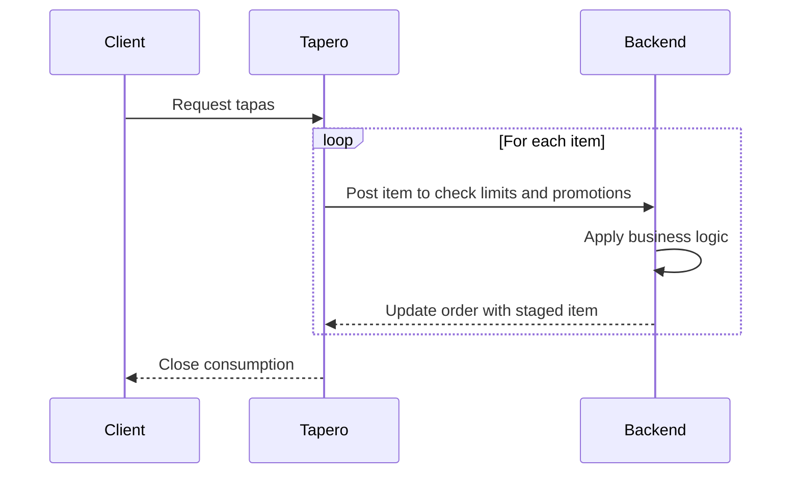

```mermaid
sequenceDiagram
    participant Client
    participant Tapero
    participant Backend
    Client->>Tapero: Request tapas
    loop For each item
        Tapero->>Backend: Post item to check limits and promotions
        Backend->>Backend: Apply business logic
        Backend-->>Tapero: Update order with staged item
    end
    Tapero-->>Client: Close consumption

```