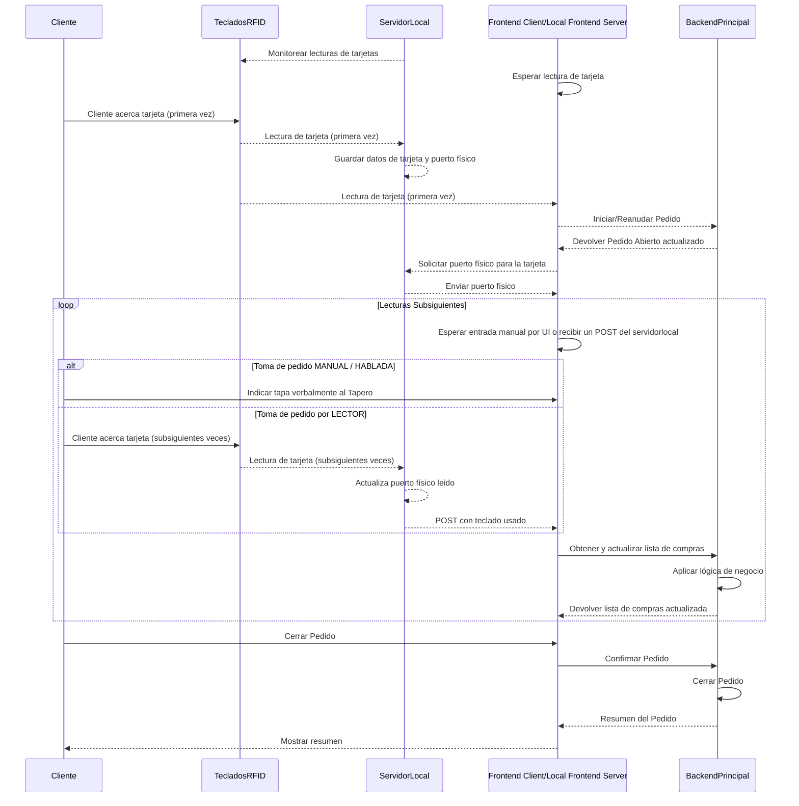

```mermaid
sequenceDiagram
    participant Cliente
    participant TecladosRFID
    participant ServidorLocal
    participant Frontend Client/Local Frontend Server
    participant BackendPrincipal

    ServidorLocal-->>TecladosRFID: Monitorear lecturas de tarjetas
    Frontend Client/Local Frontend Server->>Frontend Client/Local Frontend Server: Esperar lectura de tarjeta
        
    Cliente->>TecladosRFID: Cliente acerca tarjeta (primera vez)
    TecladosRFID-->>ServidorLocal: Lectura de tarjeta (primera vez)
    ServidorLocal-->>ServidorLocal: Guardar datos de tarjeta y puerto físico
    TecladosRFID-->>Frontend Client/Local Frontend Server: Lectura de tarjeta (primera vez)
    
    Frontend Client/Local Frontend Server-->>BackendPrincipal: Iniciar/Reanudar Pedido
    BackendPrincipal-->>Frontend Client/Local Frontend Server: Devolver Pedido Abierto actualizado

    Frontend Client/Local Frontend Server-->>ServidorLocal: Solicitar puerto físico para la tarjeta
    ServidorLocal-->>Frontend Client/Local Frontend Server: Enviar puerto físico

    
    loop Lecturas Subsiguientes
        Frontend Client/Local Frontend Server->>Frontend Client/Local Frontend Server: Esperar entrada manual por UI o recibir un POST del servidorlocal
        alt Toma de pedido MANUAL / HABLADA
            Cliente->>Frontend Client/Local Frontend Server: Indicar tapa verbalmente al Tapero
        else Toma de pedido por LECTOR
            Cliente->>TecladosRFID: Cliente acerca tarjeta (subsiguientes veces)
            TecladosRFID-->>ServidorLocal: Lectura de tarjeta (subsiguientes veces)
            ServidorLocal-->>ServidorLocal: Actualiza puerto físico leido
            ServidorLocal-->>Frontend Client/Local Frontend Server: POST con teclado usado
        end

        Frontend Client/Local Frontend Server->>BackendPrincipal: Obtener y actualizar lista de compras
        BackendPrincipal->>BackendPrincipal: Aplicar lógica de negocio
        BackendPrincipal-->>Frontend Client/Local Frontend Server: Devolver lista de compras actualizada
    
    end
    

    Cliente->>Frontend Client/Local Frontend Server: Cerrar Pedido
    Frontend Client/Local Frontend Server->>BackendPrincipal: Confirmar Pedido
    BackendPrincipal->>BackendPrincipal: Cerrar Pedido
    BackendPrincipal-->>Frontend Client/Local Frontend Server: Resumen del Pedido
    Frontend Client/Local Frontend Server-->>Cliente: Mostrar resumen
```