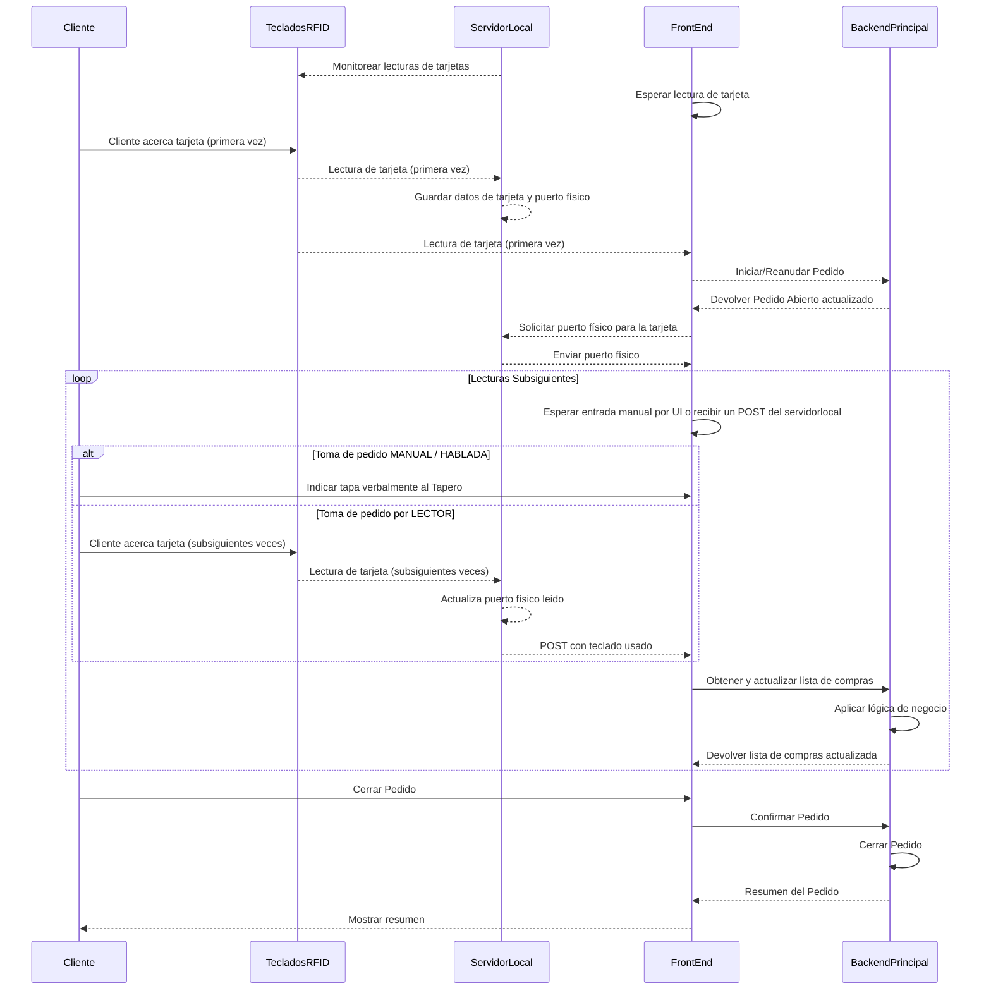

```mermaid
sequenceDiagram
    participant Cliente
    participant TecladosRFID
    participant ServidorLocal
    participant FrontEnd
    participant BackendPrincipal

    ServidorLocal-->>TecladosRFID: Monitorear lecturas de tarjetas
    FrontEnd->>FrontEnd: Esperar lectura de tarjeta
        
    Cliente->>TecladosRFID: Cliente acerca tarjeta (primera vez)
    TecladosRFID-->>ServidorLocal: Lectura de tarjeta (primera vez)
    ServidorLocal-->>ServidorLocal: Guardar datos de tarjeta y puerto físico
    TecladosRFID-->>FrontEnd: Lectura de tarjeta (primera vez)
    
    FrontEnd-->>BackendPrincipal: Iniciar/Reanudar Pedido
    BackendPrincipal-->>FrontEnd: Devolver Pedido Abierto actualizado

    FrontEnd-->>ServidorLocal: Solicitar puerto físico para la tarjeta
    ServidorLocal-->>FrontEnd: Enviar puerto físico

    
    loop Lecturas Subsiguientes
        FrontEnd->>FrontEnd: Esperar entrada manual por UI o recibir un POST del servidorlocal
        alt Toma de pedido MANUAL / HABLADA
            Cliente->>FrontEnd: Indicar tapa verbalmente al Tapero
        else Toma de pedido por LECTOR
            Cliente->>TecladosRFID: Cliente acerca tarjeta (subsiguientes veces)
            TecladosRFID-->>ServidorLocal: Lectura de tarjeta (subsiguientes veces)
            ServidorLocal-->>ServidorLocal: Actualiza puerto físico leido
            ServidorLocal-->>FrontEnd: POST con teclado usado
        end

        FrontEnd->>BackendPrincipal: Obtener y actualizar lista de compras
        BackendPrincipal->>BackendPrincipal: Aplicar lógica de negocio
        BackendPrincipal-->>FrontEnd: Devolver lista de compras actualizada
    
    end
    

    Cliente->>FrontEnd: Cerrar Pedido
    FrontEnd->>BackendPrincipal: Confirmar Pedido
    BackendPrincipal->>BackendPrincipal: Cerrar Pedido
    BackendPrincipal-->>FrontEnd: Resumen del Pedido
    FrontEnd-->>Cliente: Mostrar resumen
```