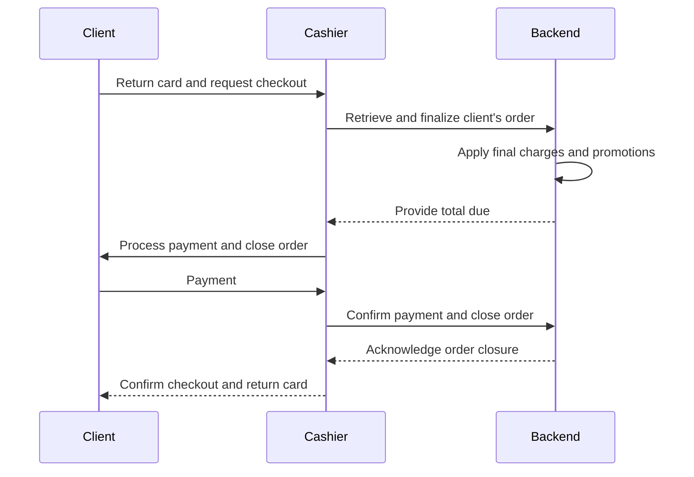

```mermaid
sequenceDiagram
    participant Client
    participant Cashier
    participant Backend
    Client->>Cashier: Return card and request checkout
    Cashier->>Backend: Retrieve and finalize client's order
    Backend->>Backend: Apply final charges and promotions
    Backend-->>Cashier: Provide total due
    Cashier->>Client: Process payment and close order
    Client->>Cashier: Payment
    Cashier->>Backend: Confirm payment and close order
    Backend-->>Cashier: Acknowledge order closure
    Cashier-->>Client: Confirm checkout and return card
```