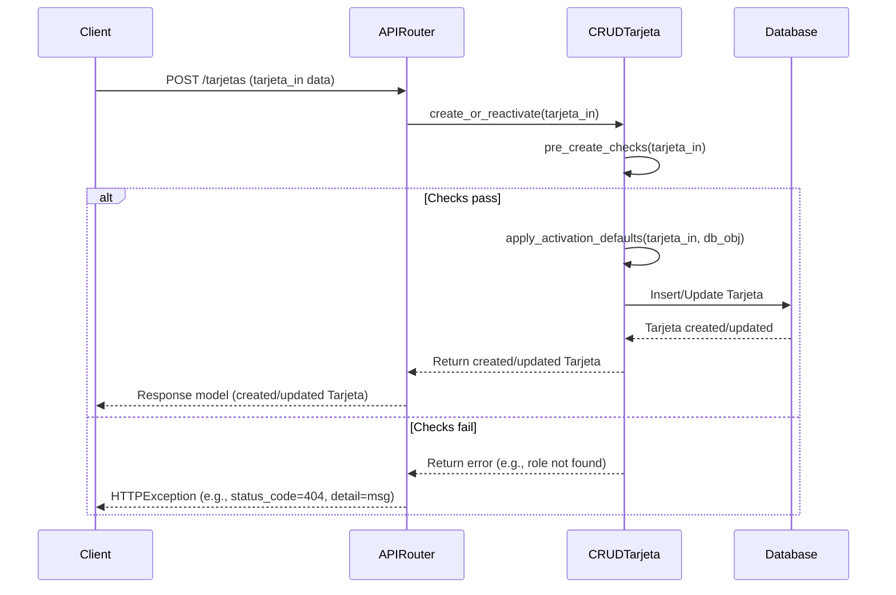

```mermaid
sequenceDiagram
    participant Client
    participant APIRouter
    participant CRUDTarjeta
    participant Database

    Client->>APIRouter: POST /tarjetas (tarjeta_in data)
    APIRouter->>CRUDTarjeta: create_or_reactivate(tarjeta_in)
    CRUDTarjeta->>CRUDTarjeta: pre_create_checks(tarjeta_in)
    alt Checks pass
        CRUDTarjeta->>CRUDTarjeta: apply_activation_defaults(tarjeta_in, db_obj)
        CRUDTarjeta->>Database: Insert/Update Tarjeta
        Database-->>CRUDTarjeta: Tarjeta created/updated
        CRUDTarjeta-->>APIRouter: Return created/updated Tarjeta
        APIRouter-->>Client: Response model (created/updated Tarjeta)
    else Checks fail
        CRUDTarjeta-->>APIRouter: Return error (e.g., role not found)
        APIRouter-->>Client: HTTPException (e.g., status_code=404, detail=msg)
    end


```