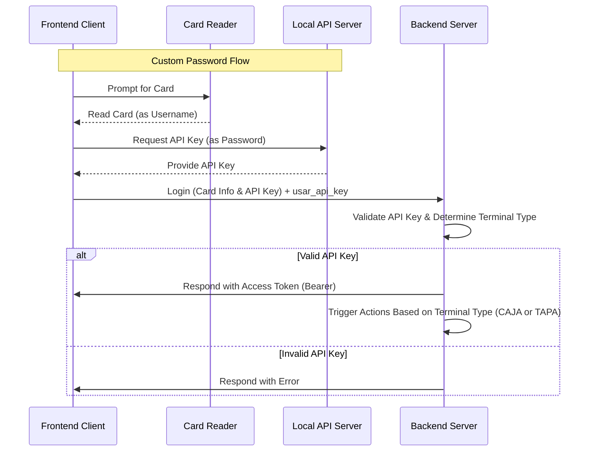

```mermaid
sequenceDiagram
participant FrontendClient as Frontend Client
    participant CardReader as Card Reader
    participant LocalAPI as Local API Server
    participant Backend as Backend Server
    Note over FrontendClient,LocalAPI: Custom Password Flow
    FrontendClient->>CardReader: Prompt for Card
    CardReader-->>FrontendClient: Read Card (as Username)
    FrontendClient->>LocalAPI: Request API Key (as Password)
    LocalAPI-->>FrontendClient: Provide API Key
    FrontendClient->>Backend: Login (Card Info & API Key) + usar_api_key
    Backend->>Backend: Validate API Key & Determine Terminal Type
    alt Valid API Key
        Backend->>FrontendClient: Respond with Access Token (Bearer)
        Backend->>Backend: Trigger Actions Based on Terminal Type (CAJA or TAPA)
    else Invalid API Key
        Backend->>FrontendClient: Respond with Error
    end    

```