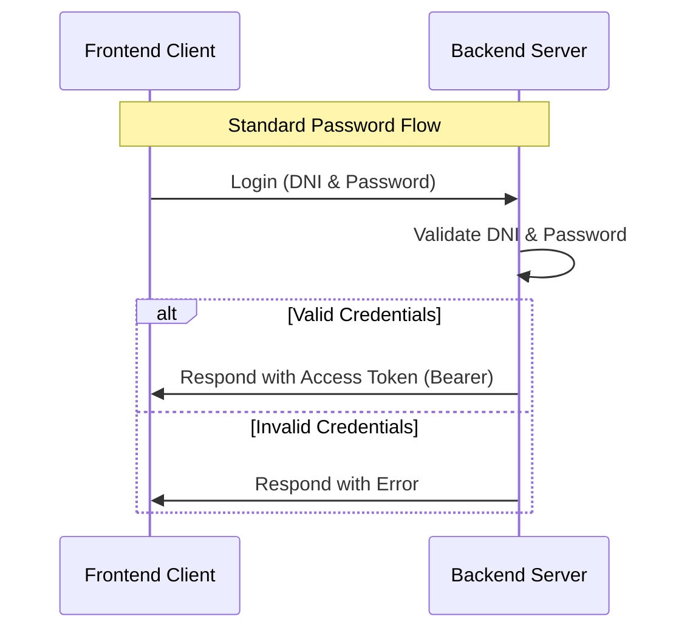

```mermaid
sequenceDiagram
    participant FrontendClient as Frontend Client
    participant Backend as Backend Server
    Note over FrontendClient,Backend: Standard Password Flow
    FrontendClient->>Backend: Login (DNI & Password)
    Backend->>Backend: Validate DNI & Password
    alt Valid Credentials
        Backend->>FrontendClient: Respond with Access Token (Bearer)
    else Invalid Credentials
        Backend->>FrontendClient: Respond with Error
    end   

```